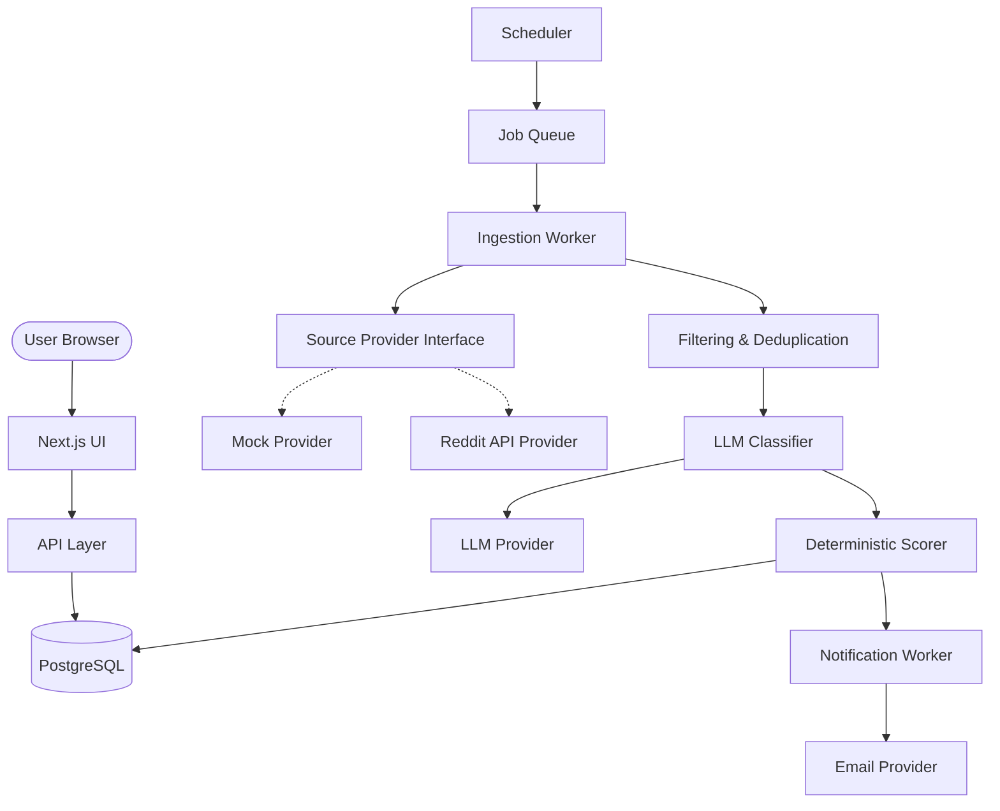

# Architecture Plan

## Overview
The "Reddit Intent" micro-SaaS discovers, analyzes, scores, surfaces, and alerts users about high-intent Reddit conversations. The architecture is explicitly designed to be modular, reliable, and decoupled from external provider volatility (like Reddit API access approvals).

## Tech Stack
*   **Frontend:** Next.js (App Router), React, Tailwind CSS, TypeScript
*   **Backend:** Next.js API Routes (or a dedicated internal service layer)
*   **Database:** PostgreSQL (using Supabase for hosting/DB/Auth, but keeping business logic framework-agnostic). ORM: Prisma.
*   **Queue / Background Jobs:** Inngest, Trigger.dev, or simple BullMQ on Redis for handling background ingestion and classification.
*   **LLM Integration:** OpenAI (via an abstracted `LLMProvider`)
*   **Notifications:** Email via Resend or SendGrid (via a `NotificationProvider`)

## Conceptual Architecture



## Modular Monorepo Structure

We will adopt a lightweight Turborepo to separate concerns:

```text
/
├── apps/
│   └── web/                   # Next.js Application (UI + API routes)
│
├── packages/
│   ├── database/              # Schema, migrations, DB client
│   ├── core/                  # Domain logic, types
│   ├── providers/
│   │   ├── reddit/            # Reddit API integration + Mocks
│   │   ├── llm/               # LLM integrations + Mocks
│   │   └── notifications/     # Email integrations + Mocks
│   └── config/                # Shared configs (ESLint, TS)
│
├── workers/                   # Background job definitions
│
└── docs/                      # Documentation
```

## The Pipeline

1. **Discovery:** The Scheduler triggers an `IngestionRun` for active projects. The `SourceProvider` (Mock or Real) fetches posts.
2. **Normalization & Deduplication:** Posts are normalized into a `RedditPost`. The system ensures `RedditPost` is only stored once globally, and mapped to a `ProjectLead` for relevant projects.
3. **Deterministic Filtering:** Simple heuristics filter out obvious spam or low-value posts before hitting the LLM.
4. **LLM Analysis:** Candidates go to the `LLMProvider` with a strict JSON schema.
5. **Scoring:** A deterministic function takes the LLM's signals and the project's preferences to assign a final `intent_score`. The `Analysis` is tied to the `ProjectLead`.
6. **Alerting:** If the score exceeds thresholds, the `NotificationWorker` dispatches an email, creating an `Alert` tied to the `ProjectLead`.

## Key Design Principles
*   **Provider Abstraction & Mock-First:** The MVP will be built completely using a `MockRedditProvider` and `MockLLMProvider` to ensure the SaaS works perfectly end-to-end without being blocked by Reddit commercial access approvals.
*   **Multi-Tenant Scalability:** A single `RedditPost` can map to multiple `ProjectLead` records. Analysis and Alerts belong to the `ProjectLead`, ensuring customized scoring and notifications per tenant.
*   **Data Integrity:** Enums ensure strict taxonomies for Keywords, Intents, and Alerts.
*   **Observability:** `IngestionRun` tracks success/failure metrics to debug customer issues.
